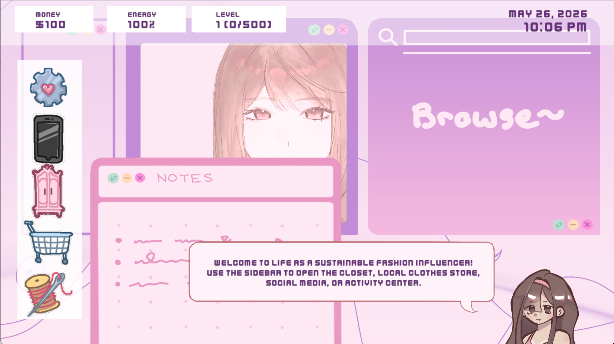
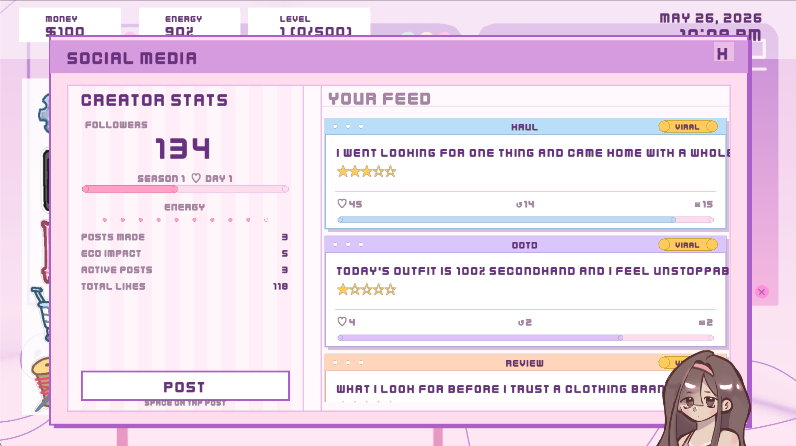
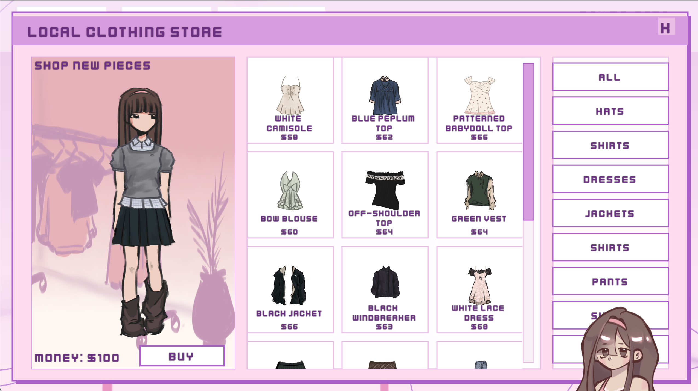

**Note:** Delete the template README.md file and rename this file to README.md before submitting.

---

# Sustainable Fashion Influencer Life

**Group Members:** Lavinia Lin, Alexandra Ma, Greyson Wrobel

## Description

In "Sustainable Fashion Influencer Life," the player enters a world where they are a fashion influencer who is trying to grow their following. They can post on their social media, earn money either by playing minigames or leveling up, and expand their closet by purchasing new clothes. There are two minigames: one where the player upcycles old clothes and earns experience when doing so, and one where the player thrifts second-hand clothing while deciding if the clothes are eco-friendly. This game is meant to educate players on the importance of sustainable clothing in the world of fast fashion, and encourages the player to educate others just like how they do in the game.

## Screenshots

## Justifications

Although the game is supposed to be more story-oriented, as stated in our design doc, we decided that it would be better to create a simulation/minigame-based game due to time constraints. In the revised game, the player enters already knowing the impact of promoting sustainable fashion on their platform, omitting the story which would show the player learning from their actions and shifting away from fast fashion before this point.

## How to Install & Play

Simply download the game executable for your operating system and double-click it to play. No installation required!

Mac:
[Download for Mac](https://github.com/lavl1100/cs10-game-Sustainable-Fashion-Influencer-Life/releases/latest/download/SustainableFashionInfluencerLife-mac.zip)

Windows:
[Download for Windows](https://github.com/lavl1100/cs10-game-Sustainable-Fashion-Influencer-Life/releases/latest/download/SustainableFashionInfluencerLife-windows.zip)
